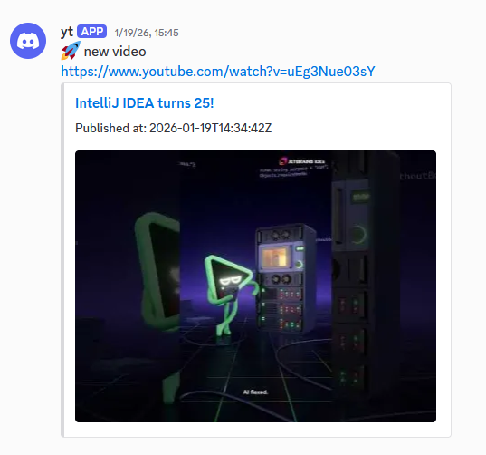

# tubefy - YouTube to Discord Notifier

[](https://github.com/wwn/tubefy/actions)
[](https://github.com/wwn/tubefy/releases)
[](https://www.oracle.com/java/)
[](https://quarkus.io/)
[](https://www.docker.com/)
[](https://github.com/wwn)

tubefy is a lightweight Discord Bot that monitors YouTube channels for new uploads and automatically announces them to Discord via webhooks.
The idea was doing a favor for my son. (Forgive me: I couldn't prevent him from YT)

Da haben wir den Fehler! Die geschweiften Klammern { } im Link waren Platzhalter – die müssen komplett weg, und der Dateiname muss exakt tubefy-base.yml lauten.

Hier ist der komplette, bereinigte Code für deine README.md. Ich habe auch die Links zu deinem Profil und dem Repo korrigiert (vorausgesetzt dein GitHub-Nutzername ist wwn).
Markdown

An independent Discord Bot based on Java and Quarkus.
***

***

***
## Features

- **Multi-Channel Support:** Monitor multiple YouTube channels simultaneously.
- **Discord Integration:** Send notifications to multiple Discord webhooks.
- **Rich Notifications:** Includes video titles, links, and high-quality thumbnails using Discord Embeds.
- **Resilience:** Built-in retry mechanism for API calls and network stability.
- **Duplicate Protection:** Ensures each video is announced only once and ignores videos older than 3x the check interval.
- **Docker Ready:** Easy deployment using Docker and Docker Compose.
- **Searching via YouTubePlayList-:** much cheaper than searching vis standard YouTube search

---

## Prerequisites

- Java 25 (if building locally)
- Docker
- A YouTube Data API v3 Key
- Discord Webhook URL(s) to send notifications to
- fancy YT channels to monitor

---

## Configuration

The application is configured using environment variables. Create a `.env` file in the project root:

```env
# Your YouTube Data API Key
YOUTUBE_API_KEY=BIzcSy...

# The interval for checking new videos (e.g., 10m, 1h, 30s)
YOUTUBE_CHECK_INTERVAL=10m #(default 20m)

# The configuration for all subscriptions
# create your json array as you can see in the example below
# validate this json vs. infrastructure/config/subscription-config.schema.json
# add the json array to the .env file as shown below
SUBSCRIPTION_CONFIG=[
  {
    "discord_webhook_url": "<DISCORD WEBHOOK URL>",
    "yt_subscriptions": [
      {
        "yt_channel_id": "<YouTub Channel ID>",
        "greetingText": "<greeting text here>"
      }
    ]
  },
  {
    "discord_webhook_url": "<DISCORD WEBHOOK URL>",
    "yt_subscriptions": [
      {
        "yt_channel_id": "<YouTub Channel ID>",
        "greetingText": "<greeting text here>"
      },
      {
        "yt_channel_id": "<YouTub Channel ID>",
        "greetingText": ""
      },
      {
        "yt_channel_id": "<YouTub Channel ID>",
        "greetingText": "<greeting text here"
      }
    ]
  }
]

# IMPORTANT for running in a Docker container:
# put all in exactly one line! as shown below
SUBSCRIPTION_CONFIG=[{"discord_webhook_url":"<DISCORD WEBHOOK URL>","yt_subscriptions":[{"yt_channel_id":"<YouTub Channel ID>","greetingText":"<greeting text here>"}]},{"discord_webhook_url":"<ISCORD WEBHOOK URL>","yt_subscriptions":[{"yt_channel_id":"<YouTub Channel ID>","greetingText":"<greeting text here>"},{"yt_channel_id":"<YouTub Channel ID>","greetingText":""},{"yt_channel_id":"<YouTub Channel ID>","greetingText":"<greeting text here"}]}]
# save your .env file now


```

---

## Deployment

### 1. Build the application
First, build the project to generate the required Quarkus artifacts:

```bash
./gradlew build
```

### 2. Run with Docker Compose
Deploy the service using the provided Docker Compose configuration:

```bash
docker compose up -d --build
```

The service will be available externally on port **49952** (mapped to internal port 8080).

---

## How it Works

1. **Scheduling:** The application polls the YouTube API at a configurable interval.
2. **Detection:** It checks the latest video for each configured channel.
3. **Validation:** It verifies if the video is new and not older than the safety threshold.
4. **Announcement:** If a new video is found, it sends a formatted embed message to all configured Discord webhooks.
5. **Memory:** The application keeps track of the last processed video ID per channel in memory (initialized on startup).

---

## Version
It's already in a good state and can be used for personal use. But lemme do some clean up and TODOs for a first release.

---

## Demo
https://discord.gg/mYPn5B3Z

## Todo's
- rate limiter
- mapping channels -> Discord webhooks (not all -> all) &#10004;
- native executable
- MDC, metrics (OTEL) & monitoring
- persist last video ID instead of algo to avoid duplicate announcements)
- a fucking gui
- Validator for videos instead of tooOld etc.

---

## License

This project is licensed under the MIT License - see the [LICENSE](LICENSE) file for details.

---
## Disclaimer
I won't pay for exeeding your YouTube API limit and anything else might happen. 
